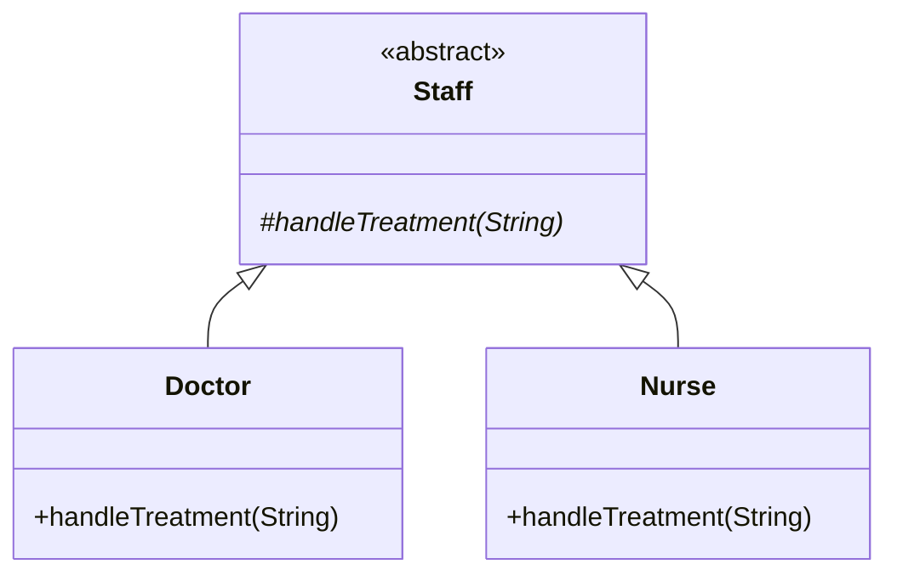
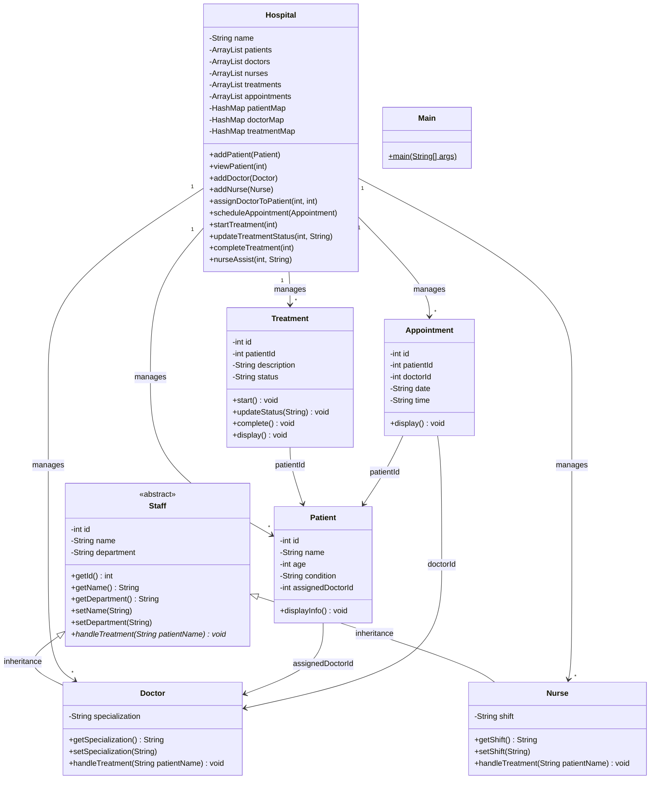

# Hospital Patient & Staff Management System

A simple **console-based Java** project for a university OOP assignment.

---

## 1. UML Class Diagrams

UML diagrams showing class structures, inheritance, relationships, attributes, and methods.

### 1.1 Inheritance Hierarchy

Shows how `Doctor` and `Nurse` inherit from abstract class `Staff`.



**Text UML (inheritance):**

```
        ┌─────────────────────┐
        │   Staff (abstract)  │
        │─────────────────────│
        │ - id                │
        │ - name              │
        │ - department        │
        │ + handleTreatment()*│
        └──────────┬──────────┘
                   │
         ┌─────────┴─────────┐
         ▼                   ▼
┌─────────────────┐ ┌─────────────────┐
│     Doctor      │ │      Nurse      │
│─────────────────│ │─────────────────│
│ - specialization│ │ - shift         │
│ + handleTreatment│ │ + handleTreatment│
└─────────────────┘ └─────────────────┘
```

---

### 1.2 Complete Class Structure Diagram

Full diagram with all classes, attributes, methods, and relationships.



### 1.3 Relationships Summary

| Relationship | Description |
|--------------|-------------|
| **Inheritance** | `Doctor` and `Nurse` extend abstract `Staff` |
| **Composition** | `Hospital` holds lists of patients, staff, treatments, appointments |
| **Association** | `Patient` links to `Doctor` via `assignedDoctorId` |
| **Association** | `Treatment` and `Appointment` link to patients (and doctors) by ID |

### 1.4 System Overview (Text UML)

```
                    ┌──────────────┐
                    │     Main     │
                    └──────┬───────┘
                           │ uses
                           ▼
                    ┌──────────────┐
                    │   Hospital   │
                    └──────┬───────┘
           ┌───────────────┼───────────────┬──────────────┐
           ▼               ▼               ▼              ▼
    ┌──────────┐    ┌──────────┐    ┌───────────┐  ┌─────────────┐
    │ Patient  │    │  Doctor  │    │ Treatment │  │ Appointment │
    └────┬─────┘    └────┬─────┘    └───────────┘  └─────────────┘
         │               │
         │ assigned to   │ extends
         └───────────────┤
                         ▼
                  ┌──────────────┐
                  │ Staff (abs)  │
                  └──────┬───────┘
                         │
              ┌──────────┴──────────┐
              ▼                     ▼
       ┌──────────┐          ┌──────────┐
       │  Doctor  │          │  Nurse   │
       └──────────┘          └──────────┘
```

---

## 2. Project Explanation

This system simulates a small hospital where you can:

- Add and view **patients**
- Register **doctors** and **nurses**
- **Assign** a doctor to a patient
- **Schedule** appointments
- **Start**, **update**, and **complete** treatments
- See **doctor–patient** and **nurse–patient** interaction through polymorphism

The program runs from a text menu in `Main.java`. All data is stored in memory using `ArrayList` and `HashMap` (no database, no frameworks).

### Project Structure

```
hospital-management-system/
│
├── README.md
└── src/
    ├── Patient.java
    ├── Staff.java
    ├── Doctor.java
    ├── Nurse.java
    ├── Treatment.java
    ├── Appointment.java
    ├── Hospital.java
    └── Main.java
```

### How to Run

```bash
cd src
javac *.java
java Main
```

**Requirements:** Java JDK 8 or higher.

---

## 3. Java Source Code

All source files are in the `src/` folder. Below is a brief description of each class. Open the `.java` files for full code and comments.

### Patient.java

Stores patient details with private fields and getters/setters.

| Attribute | Type |
|-----------|------|
| id, name, age, condition | basic types |
| assignedDoctorId | int (-1 if no doctor) |

**Key methods:** `displayInfo()` — prints patient information.

---

### Staff.java (Abstract)

Base class for hospital staff. Demonstrates **abstraction** and **encapsulation**.

| Attribute | Type |
|-----------|------|
| id, name, department | private |

**Key method:** `handleTreatment(String patientName)` — abstract; overridden in subclasses.

---

### Doctor.java

Extends `Staff`. Adds `specialization`.

**Polymorphism:** Overrides `handleTreatment()` to show doctor treating a patient.

---

### Nurse.java

Extends `Staff`. Adds `shift` (e.g. Morning, Night).

**Polymorphism:** Overrides `handleTreatment()` to show nurse assisting a patient.

---

### Treatment.java

Tracks treatment for a patient. Status: `Pending` → `In Progress` → `Completed`.

| Method | Purpose |
|--------|---------|
| `start()` | Begin treatment |
| `updateStatus(String)` | Change status |
| `complete()` | Mark as completed |
| `display()` | Show treatment details |

---

### Appointment.java

Stores scheduled visit: patient ID, doctor ID, date, and time.

**Key method:** `display()` — prints appointment details.

---

### Hospital.java

Central manager class. Uses **ArrayList** for lists and **HashMap** for fast lookup by ID.

| Collection | Used for |
|------------|----------|
| `ArrayList<Patient>` | All patients |
| `ArrayList<Doctor>` | All doctors |
| `ArrayList<Nurse>` | All nurses |
| `ArrayList<Treatment>` | All treatments |
| `ArrayList<Appointment>` | All appointments |
| `HashMap<Integer, Patient>` | Find patient by ID |
| `HashMap<Integer, Doctor>` | Find doctor by ID |
| `HashMap<Integer, Treatment>` | Find treatment by ID |

**Key methods:**

- `addPatient()`, `viewPatient()`
- `addDoctor()`, `addNurse()`
- `assignDoctorToPatient()` — links doctor to patient and calls `handleTreatment()`
- `addTreatment()`, `startTreatment()`, `updateTreatmentStatus()`, `completeTreatment()`
- `scheduleAppointment()`
- `nurseAssist()` — nurse helps patient (polymorphism demo)

---

## 4. Main.java (Entry Point)

`Main.java` is the program entry point. It:

1. Creates a `Hospital` object
2. Pre-loads sample doctors and nurses
3. Shows a menu loop until the user chooses Exit (0)

### Menu Options

| Choice | Action |
|--------|--------|
| 1 | Add Patient |
| 2 | View Patient |
| 3 | Assign Doctor to Patient |
| 4 | Start Treatment |
| 5 | Update Treatment Status |
| 6 | Complete Treatment |
| 7 | Schedule Appointment |
| 8 | Nurse Assist (Polymorphism Demo) |
| 0 | Exit |

---

## 5. Sample Output

Example console session:

```
=== Hospital Patient & Staff Management ===
1. Add Patient
2. View Patient
3. Assign Doctor to Patient
4. Start Treatment
5. Update Treatment Status
6. Complete Treatment
7. Schedule Appointment
8. Nurse Assist (Polymorphism Demo)
0. Exit
Enter choice: 1
Patient ID: 101
Name: Ahmed
Age: 35
Condition: Fever
Patient added: Ahmed

Enter choice: 3
Doctor ID: 1
Patient ID: 101
Doctor Dr. Ali assigned to patient Ahmed
Doctor Dr. Ali (Heart Specialist) is treating patient: Ahmed

Enter choice: 4
Treatment ID: 1
Patient ID: 101
Description: Blood test
Treatment 1 started.

Enter choice: 5
Treatment ID: 1
New status: Under observation
Treatment 1 status updated to: Under observation

Enter choice: 6
Treatment ID: 1
Treatment 1 completed.

Enter choice: 7
Appointment ID: 1
Patient ID: 101
Doctor ID: 1
Date (e.g. 2026-05-20): 2026-05-20
Time (e.g. 10:30): 10:30
Appointment scheduled (ID: 1)
Appointment ID: 1
Patient ID: 101 | Doctor ID: 1
Date: 2026-05-20 | Time: 10:30
------------------------

Enter choice: 8
Patient name for nurse assist: Ahmed
Nurse Nurse Ayesha (Morning shift) is assisting with patient: Ahmed

Enter choice: 0
Goodbye!
```

---

## 6. Report

### 6.1 Project Overview

The **Hospital Patient & Staff Management System** is a beginner-level Java console application. It helps manage hospital records such as patients, medical staff, treatments, and appointments. The project focuses on demonstrating core OOP concepts in a clear and simple way, suitable for a university assignment.

### 6.2 OOP Concepts Used

| Concept | Where used |
|---------|------------|
| **Encapsulation** | Private fields in `Patient`, `Staff`, `Treatment`, `Appointment`, etc. with getters/setters |
| **Inheritance** | `Doctor` and `Nurse` extend `Staff` |
| **Polymorphism** | `handleTreatment()` overridden in `Doctor` and `Nurse` |
| **Abstraction** | Abstract class `Staff` with abstract method `handleTreatment()` |
| **Collections** | `ArrayList` and `HashMap` in `Hospital` |

### 6.3 Encapsulation

Encapsulation means hiding data inside a class and providing controlled access through methods.

In this project, attributes like `name`, `age`, and `condition` in `Patient` are **private**. Other classes cannot change them directly. They use **getters** (to read values) and **setters** (to update values). This protects data and keeps the code organized.

**Example:** `Patient` has `private String name` and `public String getName()` / `public void setName(String name)`.

### 6.4 Inheritance

Inheritance allows a class to reuse fields and methods from a parent class.

`Staff` is the **superclass**. `Doctor` and `Nurse` are **subclasses** that inherit `id`, `name`, `department`, and common methods. Each subclass adds its own attribute (`specialization` for doctors, `shift` for nurses).

This avoids repeating the same code in both classes.

### 6.5 Polymorphism

Polymorphism means “many forms” — the same method name can behave differently in different classes.

Both `Doctor` and `Nurse` override `handleTreatment(String patientName)`:

- **Doctor:** prints that the doctor is treating the patient.
- **Nurse:** prints that the nurse is assisting the patient.

When `Hospital.assignDoctorToPatient()` calls `doc.handleTreatment()`, the **doctor’s** version runs. When `nurseAssist()` calls `nurse.handleTreatment()`, the **nurse’s** version runs. Same method name, different behavior.

### 6.6 Abstraction

Abstraction hides complex details and shows only what is necessary.

`Staff` is an **abstract class**. You cannot create a `Staff` object directly. It defines the idea of “staff” and declares `handleTreatment()` without a body. Subclasses **must** implement it. This is a simple, clean way to show abstraction using one abstract class only (no interface in this project).

### 6.7 Collections Used

| Collection | Purpose |
|------------|---------|
| **ArrayList** | Store multiple patients, doctors, nurses, treatments, and appointments in order |
| **HashMap** | Quickly find a patient, doctor, or treatment by ID instead of searching the whole list |

`ArrayList` is good for storing all records. `HashMap` is good for fast lookup when the user enters an ID in the menu.

### 6.8 Required Features Checklist

| Feature | Implemented in |
|---------|----------------|
| Add patients | `Hospital.addPatient()`, menu option 1 |
| View patient info | `Hospital.viewPatient()`, menu option 2 |
| Add doctors | `Hospital.addDoctor()` (pre-loaded + extensible) |
| Assign doctor to patient | `Hospital.assignDoctorToPatient()`, menu option 3 |
| Schedule appointments | `Hospital.scheduleAppointment()`, menu option 7 |
| Start treatment | `Treatment.start()`, menu option 4 |
| Update treatment status | `Treatment.updateStatus()`, menu option 5 |
| Complete treatment | `Treatment.complete()`, menu option 6 |
| Nurse assists patient | `Hospital.nurseAssist()`, menu option 8 |
| Doctor–patient interaction | `assignDoctorToPatient()` + `handleTreatment()` |

### 6.9 Documentation (In-Code Comments)

Each `.java` file includes:

- A short **class-level** comment explaining the class role
- Brief **method** comments for constructors and important methods

Comments are kept simple and not excessive, as required for a student project.

### 6.10 Conclusion

This project successfully demonstrates fundamental OOP principles in Java through a practical hospital management scenario. Encapsulation protects data, inheritance organizes staff types, polymorphism allows flexible behavior for doctors and nurses, and abstraction defines a common staff structure. Collections make it easy to store and retrieve records in a console application.

The code is intentionally kept short, readable, and suitable for university-level submission without over-engineering.

---

## Authors

University OOP Assignment — Shumail & Zehra

## License

Educational use only.
